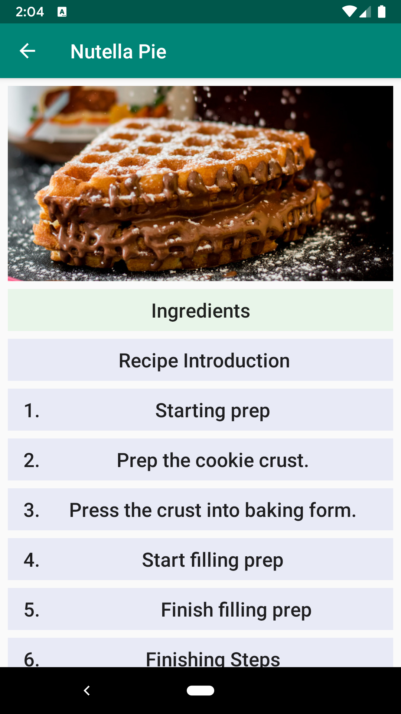
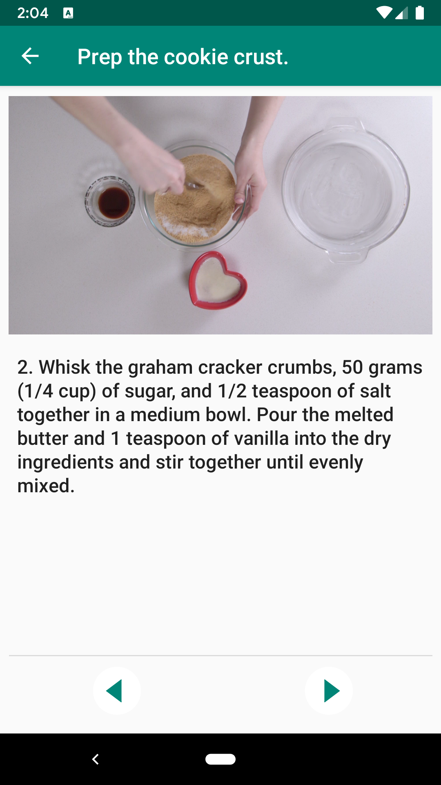
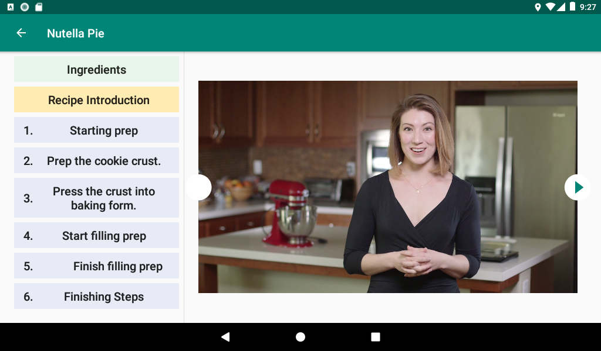

# bakingtime
Baking Time is an Android application developed as a 
final project of the Udacity Advanced Android App 
Development course. 

The Baking Time allows viewing cooking recipes, 
ingredients, and videos for the cooking steps.

The recipes are provided by a dedicated backend service.
The videos are stored on Youtube.

## Purpose of the Project

The main purpose of this project is to learn Android 
Jetpack architecture components, Room persistence
API, Widget development, accessibility, and many other
aspects of Android development.

## Outcome of the Project

The project was build from based on mock UI screens that were 
provided in the class assignment. The data for the recipes were 
provided from an AppEngine server.

The project demonstrates implementation of the master / detail
UI pattern. It embeds MediaPlayer/Exoplayer to display videos.
The UI is implemented with Fragments, LiveData and ViewModes to 
create a responsive design that works on phones and tablets.

## Screenshots

Here are a couple of screenshots that show a recipe steps and a
video for one of the steps:

||

Here is how the application looks on a tablet:

Please see more screenshot in the project [docs](./docs/images)

## Contribution

This is a learning project. It is open for comments and suggestions.
This project is not intended for code contributions.

## Usage Details

To use the project, please open it in Android Studio and build by
following general Android Application build instructions.

The data source URLs are set in the gradle.properties file.

Please review the file and try a sample test data URL that will display recipe
images.

## License

This code is distributed under [MIT license](https://opensource.org/licenses/MIT).

Copyright (c) [2019] [Mykola Dzyuba]

Permission is hereby granted, free of charge, to any person obtaining a copy
of this software and associated documentation files (the "Software"), to deal
in the Software without restriction, including without limitation the rights
to use, copy, modify, merge, publish, distribute, sublicense, and/or sell
copies of the Software, and to permit persons to whom the Software is
furnished to do so, subject to the following conditions:

The above copyright notice and this permission notice shall be included in all
copies or substantial portions of the Software.

THE SOFTWARE IS PROVIDED "AS IS", WITHOUT WARRANTY OF ANY KIND, EXPRESS OR
IMPLIED, INCLUDING BUT NOT LIMITED TO THE WARRANTIES OF MERCHANTABILITY,
FITNESS FOR A PARTICULAR PURPOSE AND NONINFRINGEMENT. IN NO EVENT SHALL THE
AUTHORS OR COPYRIGHT HOLDERS BE LIABLE FOR ANY CLAIM, DAMAGES OR OTHER
LIABILITY, WHETHER IN AN ACTION OF CONTRACT, TORT OR OTHERWISE, ARISING FROM,
OUT OF OR IN CONNECTION WITH THE SOFTWARE OR THE USE OR OTHER DEALINGS IN THE
SOFTWARE.